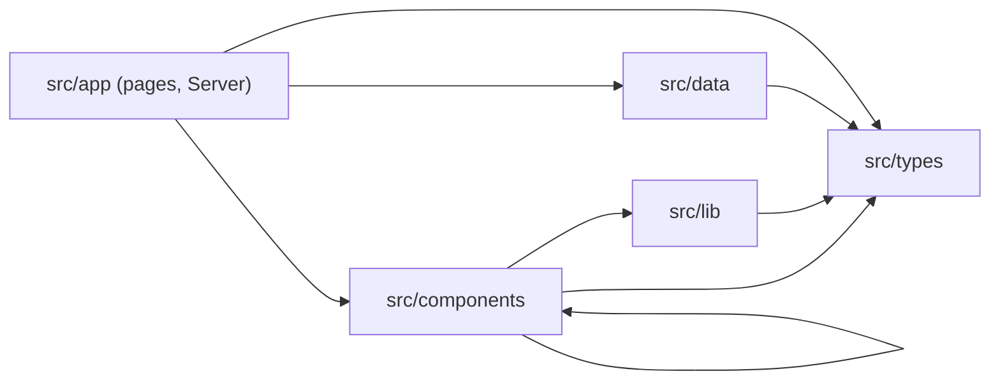
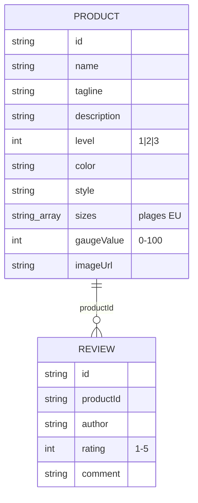
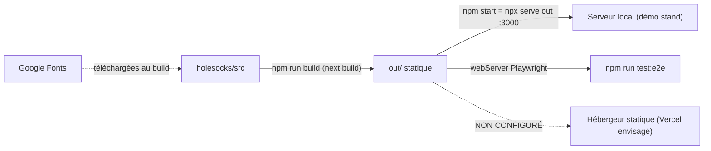

# Architecture : HoleSocks

Ce document décrit l'architecture **telle qu'elle existe** dans `holesocks/` au commit `2ee4436` (2026-10-09). Il remplace la version du 2026-05-17, rédigée avant l'implémentation. Ce qui est prévu sans être implémenté est marqué **[NON IMPLÉMENTÉ]**. Les règles d'implémentation au quotidien (conventions de code, styles, pièges) sont dans `_bmad-output/project-context.md`, qui fait référence pour les agents.

## Paradigme

Site **statique pré-rendu** : `next build` produit des fichiers HTML/CSS/JS dans `out/`, servis tels quels par n'importe quel hébergeur statique. Il n'y a ni serveur applicatif, ni API, ni base de données, ni appel réseau à l'exécution.

Dans l'App Router, chaque **page est un Server Component**, exécuté une seule fois au build : elle importe les données et rend le HTML. L'interactivité vit dans des **îlots Client Components** (`"use client"`), qui reçoivent leurs données en props et ne gèrent qu'un état local au navigateur.

| Couche | Dossier | Rôle |
| --- | --- | --- |
| Routes (Server Components) | `holesocks/src/app/` | Pages, layout racine, métadonnées, `generateStaticParams` |
| Composants | `holesocks/src/components/<feature>/` | UI ; les composants interactifs sont des Client Components |
| Logique client | `holesocks/src/lib/` | Hooks d'état local (`useFilters`) |
| Données | `holesocks/src/data/` | Catalogue et avis, modules TypeScript typés |
| Types | `holesocks/src/types/` | Interfaces `Product`, `Review`, `FilterState` |
| Assets | `holesocks/public/images/` | Photos produit `<id>.png` |



Sens des dépendances : seules les pages importent `src/data/`. Les composants importent d'autres composants, les hooks de `src/lib/`, les types et des bibliothèques (`next/link`, `framer-motion`), jamais les données.

## Invariants & règles

### AD-1 : Export statique pur [ADOPTED]

- **Lie (binds) :** tout `holesocks/`
- **Empêche (prevents) :** qu'une fonctionnalité exige un runtime Node et casse l'hébergement statique.
- **Règle (rule) :** `next.config.ts` garde `output: "export"` et `images.unoptimized: true`. Interdits : API routes (`app/api/`), middleware, SSR à la requête, ISR, Server Actions, `next/headers`, cookies, `fetch()` à l'exécution. Toute route dynamique déclare `generateStaticParams()`.

### AD-2 : Données en modules TypeScript typés [ADOPTED]

- **Lie (binds) :** catalogue, avis, toute donnée de contenu
- **Empêche (prevents) :** deux sources ou deux formes pour la même donnée.
- **Règle (rule) :** le catalogue est `PRODUCTS: Product[]` dans `src/data/products.ts`, les avis `REVIEWS: Review[]` dans `src/data/reviews.ts`, typés par `src/types/product.ts`. Pas de fichier `.json` importé, pas d'interface redéfinie ailleurs. Un produit est identifié par un `id` kebab-case, qui est aussi le segment d'URL `/produit/<id>` et le nom de l'image `public/images/<id>.png`. Le ton décalé est porté par les données (`tagline`, `description`), pas par les composants.

### AD-3 : Frontière Server → Client par les props [ADOPTED]

- **Lie (binds) :** `src/app/`, `src/components/`
- **Empêche (prevents) :** que des composants client lisent les données chacun à leur façon.
- **Règle (rule) :** seules les pages importent `@/data/*`. Elles passent les données en props aux composants : `CataloguePage` → `CatalogueClient` (client), `ProductPage` → `ReviewSection` (client) et `BricoleurKit` (serveur). L'ordre d'affichage suit celui du tableau `PRODUCTS`, et chaque page calcule sa propre sélection : un produit par niveau sur l'accueil, jusqu'à 3 produits du même niveau pour le Kit du Bricoleur.

### AD-4 : État local uniquement, rien de persisté [ADOPTED]

- **Lie (binds) :** filtres, avis, toute interaction
- **Empêche (prevents) :** l'arrivée d'un store global ou d'une persistance cachée.
- **Règle (rule) :** pas de Context, Redux, Zustand ni équivalent. Les filtres du catalogue vivent dans le hook `useFilters` (`useState`) et ne sont pas conservés entre deux pages. Le catalogue ne lit pas l'URL. Écart existant : les liens de niveau de la Navbar envoient pourtant `?level=N`, ce qui est ignoré (question ouverte 1). Un avis soumis par `ReviewForm` reçoit l'id `review-<timestamp>` et s'ajoute en tête de l'état local de `ReviewSection`. Il disparaît au rechargement : pas de `localStorage`, pas d'envoi. Le titre « Avis clients (N) » est calculé au build et ne compte pas les avis ajoutés. Aucun état de pointure sélectionnée n'existe : les boutons de pointure et le CTA « Adopter ce trou » n'ont pas de comportement.

### AD-5 : Images via `OptimizedImage` [ADOPTED]

- **Lie (binds) :** tout affichage d'image produit
- **Empêche (prevents) :** des gestions d'image divergentes (chargement, erreur, fallback).
- **Règle (rule) :** passer par `@/components/ui/OptimizedImage` (client), qui enveloppe `next/image` pour les images locales, retombe sur un `` natif pour les URL externes et gère le chargement et l'erreur. L'optimisation d'image de Next est désactivée par l'export statique : les PNG sont servis tels quels. Exception existante, à ne pas recopier : `` natif dans `app/produit/[id]/page.tsx`.

### AD-6 : Design system dans `globals.css` [ADOPTED]

- **Lie (binds) :** tout le styling
- **Empêche (prevents) :** des couleurs ou polices en dur qui divergent de la charte.
- **Règle (rule) :** Tailwind CSS v4 configuré par `@theme inline` dans `src/app/globals.css`, sans `tailwind.config.ts`. Seuls les tokens de la charte sont utilisés (`charbon`, `creme`, `acidule`, `sauge`, `ambre`, `terra`, `gris`). Les polices Bebas Neue, DM Serif Display et Syne sont chargées par `next/font/google` dans `layout.tsx` et utilisées via `font-display`, `font-editorial` et `font-ui`. Animations : Framer Motion (`HoleGauge`).

### AD-7 : Tests e2e contre le build statique [ADOPTED]

- **Lie (binds) :** toute page livrée
- **Empêche (prevents) :** qu'une page soit testée contre le serveur de dev et casse en export.
- **Règle (rule) :** Playwright (Chromium), une spec par page dans `tests/e2e/`. Les tests tournent contre `out/`, servi par `npx serve out` sur le port 3000, et exigent donc un `next build` préalable. Sélecteurs accessibles uniquement (`getByRole`, `getByText`). Pas de tests unitaires configurés.

## Conventions de cohérence

| Sujet | Convention |
| --- | --- |
| Nommage | Composants en PascalCase (export nommé) ; pages et layouts en `export default` ; hooks `useXxx` ; constantes en SCREAMING_SNAKE_CASE ; interfaces sans préfixe `I` |
| Identifiants | `id` produit en kebab-case (`le-philosophe`) ; `id` avis `review-<n>` dans les données, `review-<timestamp>` pour un avis ajouté ; lien par `productId` |
| Valeurs de filtre | `color` en codes anglais (`black`, `red`, `blue`, `white`), `style` en codes français (`orteil`, `talon`, `semelle`). Les listes acceptées et leurs libellés français sont fixés dans `FilterBar.tsx` ; la fiche produit affiche le code brut avec une majuscule. Un produit dont la valeur est absente de `FilterBar` ne peut pas être filtré |
| Pointures | Plages EU en chaîne : `"34-38"`, `"38-42"`, `"42-46"`, `"46-50"` (remplacent S/M/L/XL depuis 2026-05-29) |
| Niveau de trou | `level: 1 \| 2 \| 3` = Léger / Aéré / Catastrophe (sauge / ambre / terra) ; `gaugeValue` de 0 à 100. Cette correspondance est recopiée dans six fichiers (`HoleGauge`, `ProductCard`, `FilterBar`, `Navbar`, `app/page.tsx`, `manifeste/page.tsx`), sans source unique |
| Imports | Alias `@/` → `src/`, jamais de `../../` |
| Accessibilité | Lien d'évitement + `<main id="main-content">` dans le layout ; `<section aria-label>` pour les sections testées ; `HoleGauge` en `role="progressbar"` |
| Mise en page | Navbar fixe (72 px) dans le layout racine : le premier conteneur de chaque page la dégage (`pt-[72px]`, ou plus comme `/manifeste`) |

## Stack

Versions lues dans `holesocks/package.json` au commit `2ee4436`.

| Nom | Version |
| --- | --- |
| Next.js (App Router, `output: "export"`) | 16.2.6 |
| React / React DOM | 19.2.4 |
| TypeScript (strict) | ^5 |
| Tailwind CSS (+ `@tailwindcss/postcss`) | ^4 |
| Framer Motion | ^12.38.0 |
| Playwright (`@playwright/test`) | ^1.60.0 |
| ESLint (flat config, `eslint-config-next`) | ^9 / 16.2.6 |
| Node.js | non épinglé (Next 16 exige ≥ 20.9) |

## Structure

### Routes

| Route | Fichier | Rendu |
| --- | --- | --- |
| `/` | `app/page.tsx` | Server : hero, 3 niveaux (1 produit par niveau), section Manifeste (3 piliers), CTA |
| `/catalogue` | `app/catalogue/page.tsx` → `CatalogueClient` | Server → Client : grille + filtres niveau, style, couleur, pointure |
| `/produit/[id]` | `app/produit/[id]/page.tsx` | Server async + `generateStaticParams()` : 8 pages ; jauge, pointures, CTA, avis, Kit du Bricoleur (jusqu'à 3 produits du même niveau) |
| `/manifeste` | `app/manifeste/page.tsx` | Server, `metadata` propre : pourquoi, 3 niveaux, CTA catalogue |
| `/<inconnu>` | page 404 par défaut de Next | Pas de `not-found.tsx` ni d'`error.tsx` |

### Arborescence (code applicatif versionné)

```text
holesocks/
  next.config.ts            # output: "export", images.unoptimized
  eslint.config.mjs         # ESLint 9 flat config
  playwright.config.ts      # webServer: npx serve out --listen 3000
  postcss.config.mjs
  tsconfig.json             # strict, alias @/ → src/
  test-build.mjs            # script de diagnostic ad hoc (pas un test)
  public/images/<id>.png    # 8 photos produit
  src/
    app/
      layout.tsx            # polices, lien d'évitement, <Navbar/>, <main>
      globals.css           # @theme inline (tokens), reduced-motion
      page.tsx              # /
      catalogue/page.tsx    # /catalogue
      produit/[id]/page.tsx # /produit/[id]
      manifeste/page.tsx    # /manifeste
    components/
      catalogue/CatalogueClient.tsx
      filters/FilterBar.tsx, FilterChip.tsx
      product/ProductCard.tsx, HoleGauge.tsx, ProductDetailClient.tsx (non utilisé)
      reviews/ReviewSection.tsx, ReviewList.tsx, ReviewCard.tsx, ReviewForm.tsx
      kit/BricoleurKit.tsx
      ui/Navbar.tsx, OptimizedImage.tsx
    data/products.ts        # PRODUCTS (8)
    data/reviews.ts         # REVIEWS (10)
    lib/useFilters.ts
    types/product.ts        # Product, Review, FilterState
    */README.md             # intentions initiales ; le code fait foi
  tests/e2e/                # home, catalogue, product, manifeste .spec.ts
```

### Modèle de données



`FilterState` (`level?`, `color?`, `style?`, `size?`) est un état UI, pas une donnée. `color` et `style` sont des chaînes libres dans le type ; les valeurs proposées dans les filtres sont fixées par `FilterBar.tsx`.

### Build, tests et déploiement



- **Commandes** (depuis `holesocks/`) : `npm ci`, `npm run dev`, `npm run build`, `npm run lint`, `npm run build && npm run test:e2e`.
- **CI** : aucune. Vérification locale (lint, build, e2e).
- **Déploiement** : aucun configuré dans le dépôt. Seul `.vercel` est ignoré par Git. `npm start` sert `out/` en local.
- **Variables d'environnement** : aucune.

## Correspondance exigences → architecture

| Exigence (PRD) | Emplacement | Régie par |
| --- | --- | --- |
| Page d'accueil, ton décalé | `app/page.tsx` | AD-1, AD-2 |
| Manifeste | `app/manifeste/page.tsx` (+ section Manifeste de l'accueil) | AD-1 |
| Filtres catalogue | `CatalogueClient` + `filters/` + `lib/useFilters.ts` | AD-3, AD-4 |
| Fiche produit, jauge de trou, pointures | `app/produit/[id]/page.tsx`, `HoleGauge` | AD-1, AD-2, AD-6 |
| Kit du Bricoleur (cross-sell) | `kit/BricoleurKit.tsx` | AD-3, AD-5 |
| Avis clients + ajout fictif | `reviews/*`, `data/reviews.ts` | AD-2, AD-4 |
| Performance réseau salon | build statique, PNG non optimisés au build | AD-1, AD-5 |

## Prévu, non implémenté ou reporté

- **[NON IMPLÉMENTÉ] Panier, paiement, commandes.** Le CTA « Adopter ce trou » et les boutons de pointure n'ont aucune action. Le chiffrage BMA-13 (`research/chiffrage-panier-paiement-backoffice.md`) attend la décision du board. Les options A (Stripe Payment Links) et B (panier SaaS embarqué) respectent AD-1. L'option C (panier maison + Stripe Checkout) le casse et imposerait une révision de cette architecture validée par le board.
- **[NON IMPLÉMENTÉ] Pré-filtrage par URL.** Les liens de niveau de la Navbar (`/catalogue?level=N`) changent l'URL, mais le catalogue ignore le paramètre.
- **[NON IMPLÉMENTÉ] Hébergement public et CI** : voir les questions ouvertes.
- **Reportés depuis 2026-05-17 et toujours sans décision** : analytics, persistance des avis, comptes clients, internationalisation.

## Questions ouvertes

1. **Filtre par URL** : faut-il honorer `?level=N` (`useSearchParams` sous `<Suspense>`, compatible avec l'export statique) ou retirer le paramètre des liens de la Navbar ?
2. **`ProductDetailClient`** n'est utilisé par aucune route (la page produit rend en Server Component) : le supprimer ou y rebrancher la page ?
3. **Hébergement cible** : Vercel est cité depuis l'origine mais rien n'est configuré. Quel hébergeur, et qui le valide ?
4. **CI** : en mettre une (lint, build, e2e), comme le recommande BMA-13 avant tout chantier e-commerce ?
5. **Panier et paiement** : quelle option du chiffrage BMA-13 ? La réponse décide si AD-1 tient.
6. **Dette mineure** : le script `npm run export` (`next export`, supprimé depuis Next 14), `color` et `style` typés `string` au lieu d'unions, `setFilter(value: any)`, l'`` de la page produit (AD-5). Faut-il la nettoyer dans une story dédiée ?
7. **Correspondance des niveaux** : le libellé et la couleur des trois niveaux sont recopiés dans six fichiers. Faut-il une source unique (par exemple une constante dans `src/types/` ou `src/data/`) ?
8. **Chiffres dérivés des avis** : le compteur est calculé au build, la liste vit côté client. Qui doit porter les chiffres dérivés (nombre d'avis, future note moyenne) ?
9. **Pointure sélectionnée** : aucun état n'existe. Qui la portera quand le panier arrivera : un îlot client dans la fiche produit, `ProductDetailClient`, ou le panier lui-même ? À trancher avec les questions 2 et 5.
