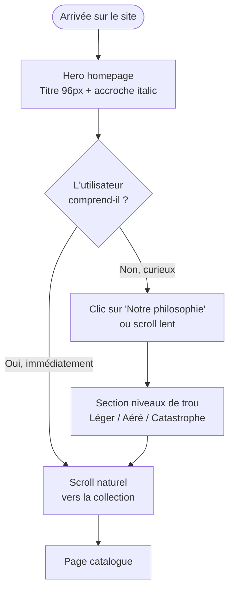
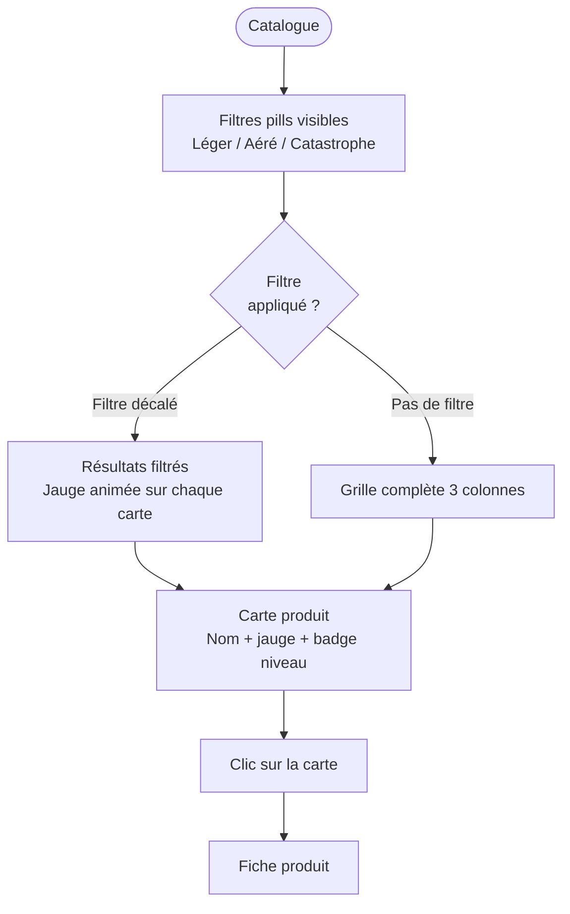
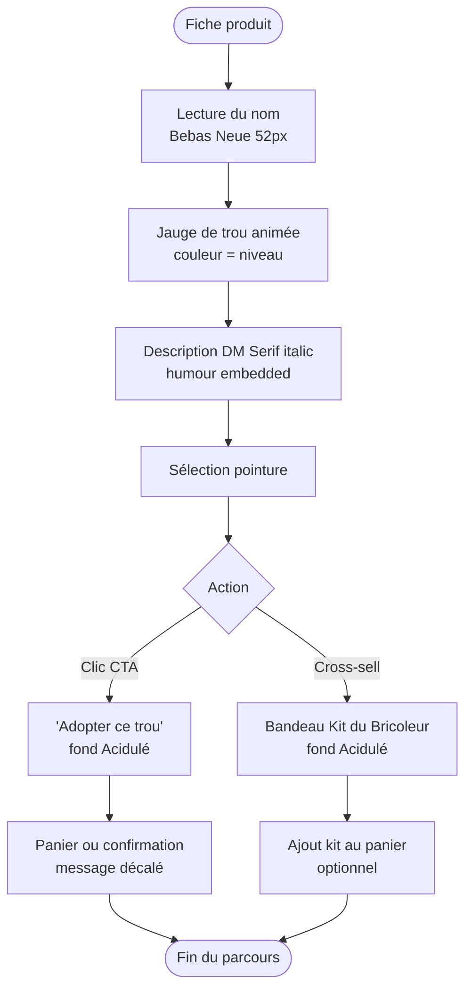
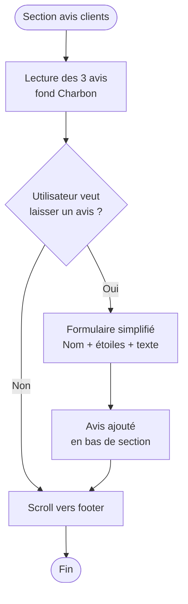

# UX Design Specification HoleSocks

**Author:** Yohann
**Date:** 2026-05-17

---

<!-- UX design content will be appended sequentially through collaborative workflow steps -->

## Executive Summary

### Vision du Projet

HoleSocks est un site e-commerce satirique qui vend des chaussettes volontairement trouées. Le concept repose sur l'absurde assumé et un ton second degré, légèrement philosophique. Pensé pour une démonstration sur salon, l'objectif principal est de provoquer le sourire instantané et d'illustrer le workflow agentique BMAD sur un cas riche en interactions.

### Utilisateurs Cibles

- **Visiteurs de salon** : curiosité immédiate, découverte rapide, niveau tech basique
- **Profil universel** : toute personne ayant un jour regardé une chaussette trouée le lundi matin
- **Comportement attendu** : exploration spontanée, consultation des produits, amusement partagé

### Défis UX Clés

1. **Communiquer l'absurde instantanément** — le visiteur doit comprendre le concept en moins de 3 secondes sans explication
2. **Rendre la navigation fun sans la rendre confuse** — les filtres doivent être intuitifs ET amusants, sans nuire à l'utilisabilité
3. **Maintenir le ton décalé à travers le visuel** — typographie, couleurs et micro-interactions doivent renforcer l'humour à chaque étape du parcours

### Opportunités de Design

1. **Micro-interactions humoristiques** — jauge de trou animée, animations de produits, réactions visuelles aux interactions
2. **Identité visuelle forte et mémorable** — se distinguer volontairement des vrais e-commerces tout en restant lisible
3. **Parcours produit surprenant** — chaque étape (accueil → catalogue → fiche → cross-sell) doit apporter une petite surprise ou un clin d'œil

## Core User Experience

### Defining Experience

L'action centrale de HoleSocks est l'**exploration des fiches produit**. Le moment clé — celui où le visiteur dit "c'est vraiment absurde, j'adore" — doit se déclencher en moins de 10 secondes après l'arrivée sur le site. Tout le design converge vers ce moment de reconnaissance et de sourire.

### Platform Strategy

Site web desktop uniquement. Pas de version mobile dédiée, pas de fonctionnalité offline. L'expérience est conçue pour un contexte de salon : grand écran, souris, navigation rapide et découverte spontanée.

### Effortless Interactions

- **Comprendre le concept** : doit être immédiat, sans lecture, juste en voyant le visuel et le nom
- **Explorer le catalogue** : filtres accessibles en un clic, résultats visibles sans rechargement
- **Lire une fiche produit** : information essentielle (nom, trou, humour) perceptible au premier regard

### Critical Success Moments

1. **L'accueil** : le visiteur comprend et sourit dans les 5 premières secondes
2. **La fiche produit** : la jauge de trou + la description décalée provoquent une réaction émotionnelle
3. **Les avis clients** : le ton humoristique déclenche un rire ou un partage verbal avec quelqu'un d'autre

### Experience Principles

1. **L'absurde en premier** — chaque écran doit surprendre avant d'informer
2. **La fluidité au service du fun** — aucune friction ne doit casser l'élan de découverte
3. **Moderne ET décalé** — l'UI emprunte les codes du e-commerce premium pour mieux les détourner
4. **Chaque détail raconte quelque chose** — typographie, couleurs, animations renforcent le ton sans l'expliquer

## Desired Emotional Response

### Primary Emotional Goals

**Objectif principal : Le sourire involontaire** — ce moment où on lève les yeux et on dit à quelqu'un à côté "regarde ça". Pas le rire forcé, pas la perplexité : la complicité.

### Emotional Journey Mapping

| Étape | Émotion cible |
|-------|---------------|
| **Accueil** | Surprise forte → "attends, c'est quoi ça ?" — animations et effets visuels marquants |
| **Catalogue** | Amusement tranquille, curiosité — simple, surréaliste, lisible |
| **Fiche produit** | Délice + complicité — "ils ont vraiment nommé ça comme ça ?" |
| **Avis clients** | Sourire franc ou éclat de rire discret |
| **Cross-sell** | Absurde assumé → sentiment d'être "dans la blague" |

### Micro-Emotions

- **Surprise** (accueil) : typographie inattendue, parallax, layouts décalés des conventions
- **Complicité** (tout le site) : ton des libellés, noms de produit, messages d'état
- **Délice** (fiche produit) : micro-animations subtiles, textes qui récompensent l'attention

### Design Implications

- **Page d'accueil** → Animations travaillées, parallax, effets visuels marquants, décalage intentionnel — c'est l'expérience principale
- **Catalogue** → Design surréaliste mais simple, pas de distraction, navigation fluide
- **Fiche produit** → Épuré, ton décalé dans le contenu plutôt que dans les effets

### Emotional Design Principles

1. **L'accueil est une scène** — on entre dans l'univers HoleSocks, pas juste dans un site
2. **Le catalogue et le produit sont au service de la lisibilité** — le surréalisme est dans le contenu, pas dans l'interface
3. **Surprendre une fois, rassurer ensuite** — l'effet wow est à l'entrée, la confiance s'installe sur le reste

## UX Pattern Analysis & Inspiration

### Inspiring Products Analysis

| Site/Produit | Ce qu'on retient |
|---|---|
| **Innocent Drinks** | Ton absurde dans le contenu, copywriting décalé sur un layout propre |
| **Deadpool marketing pages** | Hero section dramatique, humour qui se joue des conventions |
| **Linear.app / Awwwards** | Animations de scroll et parallax premium, design système cohérent |
| **Coucou Suzette / Balzac Paris** | E-commerce français avec identité forte, fiches produit claires |

### Transferable UX Patterns

**Navigation & Structure :**
- Grille produit minimaliste → catalogue lisible sans surcharge visuelle
- Copywriting comme élément UI → libellés de filtres, badges et CTA humoristiques

**Interaction :**
- Hero animé avec parallax et texte apparu au scroll → page d'accueil HoleSocks
- Jauge/indicateur visuel personnalisé → la jauge de trou comme signature de l'interface

### Anti-Patterns to Avoid

- Animations sur toutes les pages → réserver le spectacle à l'accueil uniquement
- Humour forcé dans les libellés techniques (erreurs, états de chargement) → subtil ou absent
- Layout trop expérimental sur catalogue/produit → la lisibilité prime sur l'originalité

### Design Inspiration Strategy

**Adopter :**
- Parallax + scroll animations sur le hero de la page d'accueil
- Copywriting décalé systématique sur tous les textes visibles

**Adapter :**
- Grille e-commerce standard → version surréaliste sobre sur le catalogue

**Éviter :**
- Surcharge d'effets sur les pages fonctionnelles (catalogue, fiche produit)

## Design System Foundation

### Design System Choice

**Tailwind CSS v4 (pur) + composants custom**

Approche retenue : système custom léger construit directement sur Tailwind CSS v4, déjà installé dans le projet.

### Rationale for Selection

- Tailwind CSS v4 est déjà en place — zéro coût d'adoption
- HoleSocks nécessite une identité visuelle forte et distinctive : une librairie pré-opinionée (MUI, Ant Design) irait à l'encontre de cet objectif
- Les pages catalogue et fiche produit sont simples → pas besoin d'un système lourd
- La page d'accueil avec parallax et animations nécessite du code custom de toute façon
- Framer Motion (ou `motion`) pour les animations avancées

### Implementation Approach

- Design tokens Tailwind définis dès le départ (couleurs, typographie, espacements)
- Composants custom ciblés : `HeroSection`, `ProductCard`, `HoleGauge`, `FilterBar`
- Animations : CSS natif pour les transitions simples, Framer Motion pour les effets parallax et scroll

### Customization Strategy

- Palette et typographie définies dans `tailwind.config` comme tokens nommés
- Composants réutilisables dans `src/components/` sans dépendance externe de composants UI
- Micro-animations encapsulées dans les composants concernés

## 2. Core User Experience

### 2.1 Defining Experience

> **"Je scroll la page d'accueil et je découvre que c'est sérieusement fait, mais complètement absurde."**

L'expérience définissante de HoleSocks est le moment où le visiteur comprend que le site assume totalement son concept — pas une blague de 2 secondes, mais un univers cohérent et sérieusement construit autour d'une idée absurde. Cette prise de conscience est le moteur émotionnel de tout le site.

### 2.2 User Mental Model

Les visiteurs arrivent avec le modèle mental d'un e-commerce classique. Le choc vient du décalage : même structure, même sérieux apparent, mais le produit est une chaussette trouée. Ce subvertissement du familier crée la surprise et la complicité.

### 2.3 Success Criteria

- Le visiteur scroll jusqu'en bas de la page d'accueil (engagement)
- Il clique sur au moins un produit dans le catalogue
- Il lit la description produit jusqu'aux avis clients
- Il réagit verbalement (sourire, commentaire à voix haute)

### 2.4 Novel UX Patterns

Patterns établis détournés :
- **Hero section classique** → copywriting absurde + animation parallax décalée
- **Fiche produit standard** → la jauge de trou remplace la jauge qualité/stock
- **Filtres de catalogue** → libellés décalés ("Niveau d'existentialisme", "Ampleur du regret")

### 2.5 Experience Mechanics

**Page d'accueil (expérience principale) :**
1. *Initiation* : Le titre hero arrive en scroll avec un effet parallax marquant
2. *Interaction* : Scroll progressif révèle le concept section par section
3. *Feedback* : Chaque section répond au scroll, le contenu "vit"
4. *Completion* : Le CTA vers le catalogue s'impose naturellement

**Catalogue + Fiche produit :**
- Simple, rapide, lisible — l'humour est dans le contenu, pas l'interface
- La jauge de trou est le seul élément "signature" visuel sur la fiche produit

## Visual Design Foundation

### Color System

**Palette primaire :**

| Rôle | Nom | Hex |
|------|-----|-----|
| Fond / Texte principal | Charbon | `#1C1A17` |
| Fond de page / Surfaces | Crème | `#F4EFE3` |
| CTA / Accent | Acidulé | `#D9E830` |

**Couleurs sémantiques (niveaux de trou) :**

| Niveau | Nom | Hex |
|--------|-----|-----|
| Léger | Sauge | `#7A9E7E` |
| Aéré | Ambre | `#D4A500` |
| Catastrophe | Terra | `#C44B28` |

**Neutre :** Gris philosophe `#6B6560` — textes secondaires, labels, métadonnées.

**Règles d'usage clés :**
- Fond de page toujours Crème, jamais blanc pur
- L'Acidulé uniquement en accent (CTA, hover, highlight) — jamais en fond pleine page
- Charbon sur Crème = combinaison de base ; inverse pour sections héros et footer

### Typography System

| Rôle | Fonte | Poids | Usage |
|------|-------|-------|-------|
| Display / Héros | Bebas Neue | 400 | Titres, prix — jamais le corps de texte |
| Éditorial | DM Serif Display + Italic | 400 | Descriptions produit, accroches, citations |
| UI | Syne | 400 / 700 | Navigation, labels, badges, boutons |

Trois familles, sans exception. DM Serif italic pour les accroches décalées, Syne Bold pour tous les éléments UI fonctionnels.

### Spacing & Layout Foundation

- **Base :** 8px — tokens de `--space-xs: 8px` à `--space-2xl: 96px`
- **Container :** max-width 1200px, padding horizontal 40px
- **Grille catalogue :** 3 colonnes → 2 → 1 (responsive, breakpoints 900px / 560px)
- **Généreux en espace blanc** — un site qui respire pour des chaussettes qui respirent

### Accessibility Considerations

- Charbon sur Crème : contraste >7:1 (niveau AAA)
- Acidulé jamais utilisé comme fond de texte courant
- Animations respectueuses de `prefers-reduced-motion` (à implémenter sur toutes les animations)
- Taille minimale de cible tactile : 44×44px pour les boutons et liens

---

## 3. Design Directions

### Direction Hero Retenue : C — Épurée Centrée (avec éléments A)

La direction principale pour la page d'accueil est **C (Épurée Centrée)**, enrichie de certains éléments expressifs de la direction A :

- **Typographie** : titre hero à 96px, centré, maximum d'espace blanc
- **Fond** : Crème `#F4EFE3` — clair, respirable, contraste fort
- **Accroche** : DM Serif Display italic, ton décalé
- **CTA** : fond Charbon, sobre et direct
- **Cercles décoratifs** : repris de la direction A pour les sections parallax (animations au scroll)
- **Statique / clair = humour ; dynamique / sombre = drama** — les deux coexistent

### Sections Spéciales : Direction D (Nocturne)

La direction D est adoptée pour les **sections de contraste** :
- Section Édition Catastrophe (fond `#0E0D0B`, accents Acidulé)
- Section Avis clients (fond Charbon, reviews cards semi-transparentes)
- Footer (fond Charbon, opacité dégradée)

### Catalogue : Direction Unifiée

- **Fond** : Crème
- **Filtres** : pills rondes avec couleurs sémantiques (Sauge / Ambre / Terra) + filtres décalés humoristiques
- **Grille** : 3 colonnes, cards blanches avec bordure fine
- **Jauge de trou** : présente sur chaque carte, couleur = niveau
- **Pagination** : aucune — scroll infini

### Fiche Produit : Layout Épuré 2 Colonnes

- **Gauche** : image/visuel du produit (fond Crème, illustration du trou centré)
- **Droite** : nom en Bebas Neue 52px, badge niveau, jauge signature, description DM Serif, sélecteur taille, CTA
- **CTA** : `Adopter ce trou` — fond Acidulé, couleur Charbon
- **Fil conducteur** : la jauge de trou est **l'élément signature** — présente partout, animée, cohérente

### Sections Transversales

| Section | Direction | Notes |
|---|---|---|
| Hero homepage | C + éléments A | 96px typo, centré, respiration |
| Bandeau Kit Bricoleur | Fond Acidulé | Texte Charbon, prix Bebas 72px |
| Avis clients | D Nocturne | Fond Charbon, review cards |
| Footer | D Nocturne | Opacité dégradée |
| Catalogue | Unifié Crème | Filtres pills, grille 3 col |
| Fiche produit | Épuré 2 col | Jauge signature, CTA Acidulé |

### Fichier de référence

Les mockups interactifs complets sont disponibles dans :
`_bmad-output/planning-artifacts/ux-design-directions.html`

---

## 4. User Journey Flows

### Flux 1 : Découverte & Compréhension du concept



### Flux 2 : Exploration du catalogue



### Flux 3 : Fiche produit → Adoption



### Flux 4 : Avis clients (interaction fictive)



### Journey Patterns

**Navigation** : toujours au sommet, sobre, n'interfère jamais avec le contenu hero
**Feedback visuel** : la jauge de trou = indicateur de niveau/progression sur toutes les pages
**Humour dans les micro-copies** : chaque étape clé possède une copy décalée (pas seulement les titres)
**Zéro écran d'erreur** : site statique demo, tous les chemins mènent à du contenu

### Flow Optimization Principles

- **Homepage → catalogue** : 1 scroll ou 1 clic maximum
- **Catalogue → fiche produit** : clic sur la carte entière (pas uniquement sur un bouton)
- **Fiche → panier** : CTA unique, pas de confirmation modale superflue
- **Kit Bricoleur** : cross-sell non intrusif via bandeau (jamais de popup)
- **Filtre catalogue** : état visuel immédiat, couleur = niveau, pas de rechargement de page

---

## 5. Component Strategy

### Design System Components

**Design system :** Tailwind CSS v4 pur — zéro bibliothèque de composants pré-construits. Tous les composants sont custom, construits sur des utilitaires Tailwind et des CSS variables.

Composants utilitaires couverts par Tailwind : layout (grid, flex), spacing, typography scale, color tokens, transitions, z-index, responsive breakpoints.

### Custom Components

#### `HoleGauge` — Composant signature

**Purpose :** Visualiser le niveau de trou (Léger / Aéré / Catastrophe) en un coup d'œil
**Usage :** ProductCard (size sm) et fiche produit (size lg)
**Anatomy :** Track neutre 8px · Fill coloré · Thumb 12px · Label Syne Bold 9px uppercase
**States :** Default · Animated (entrée au scroll via Framer Motion)
**Variants :** `size="sm"` (cartes) · `size="lg"` (fiche produit)
**Props :** `level: 1 | 2 | 3` · `animated?: boolean`
**Accessibility :** `role="meter"` · `aria-valuenow` · `aria-valuemin=0` · `aria-valuemax=3`
**Couleurs :** Niveau 1 → Sauge `#7A9E7E` · Niveau 2 → Ambre `#D4A500` · Niveau 3 → Terra `#C44B28`

#### `ProductCard` — Unité catalogue

**Purpose :** Présenter un produit dans la grille
**Usage :** Grille 3 colonnes, page catalogue
**Anatomy :** Thumb (fond Crème, trou centré, 4/3) · LevelBadge absolu · HoleGauge · Nom DM Serif 17px · Sous-titre Syne 12px · Prix Bebas 20px · Bouton "Adopter"
**States :** Default · Hover (`translateY(-4px)`, border Acidulé, shadow légère)
**Variants :** Une seule forme

#### `HeroSection` — Homepage showpiece

**Purpose :** Premier écran, compréhension immédiate, entrée dans le monde HoleSocks
**Usage :** Page d'accueil uniquement
**Anatomy :** Navbar · Eyebrow (couleur = édition active) · H1 Bebas 96px centré · Accroche DM Serif italic 20px · CTA double · Divider · Stats 3 colonnes
**Animations :** Fade-up titre (800ms) · Parallax au scroll · Cercles décoratifs rotation lente
**States :** Initial · Scrolled (navbar sticky, compressée)

#### `LevelBadge` — Badge sémantique

**Purpose :** Identifier le niveau au premier regard
**Usage :** ProductCard, fiche produit, filtres actifs
**Variants :**
- `level=1` → fond `#EEF5E0`, texte `#3D6B41`, label "Léger"
- `level=2` → fond `#FFF3CD`, texte `#7A5800`, label "Aéré"
- `level=3` → fond `#FDE8E2`, texte `#8B2510`, label "Catastrophe"
**Anatomy :** Syne Bold 9px · uppercase · letterspacing 0.14em · padding 4px 10px · border-radius 4px

#### `FilterPill` — Filtre catalogue

**Purpose :** Filtrer la collection avec humour dans les libellés
**Usage :** Barre de filtres, page catalogue
**States :** Inactive · Active (couleur sémantique du niveau)
**Variants :** Standard (niveaux) · Décalé (libellés humour : "Niveau d'existentialisme ↓")

#### `KitBanner` — Cross-sell Kit du Bricoleur

**Purpose :** Proposer le kit de réparation en cross-sell non intrusif
**Usage :** Fiche produit + section homepage
**Anatomy :** Fond Acidulé · Eyebrow Syne · Titre Bebas 56px · Description DM Serif italic · Prix Bebas 72px · CTA fond Charbon
**Behavior :** Bandeau pleine largeur, jamais de popup

### Component Implementation Strategy

- Chaque composant est un fichier `.tsx` dans `holesocks/src/components/`
- Les tokens de design (`--hs-black`, `--hs-cream`, etc.) sont définis dans le CSS global et utilisés via `var()` ou classes Tailwind custom
- Les animations sont gérées par Framer Motion (`motion.div`, `useInView`, `useScroll`)
- `prefers-reduced-motion` : toutes les animations sont conditionnées via un hook custom `useReducedMotion()`

### Implementation Roadmap

**Phase 1 — Core (bloquant démo)**
- `LevelBadge` — partout, fondation
- `HoleGauge` — catalogue et fiche produit
- `ProductCard` — grille catalogue
- `HeroSection` — homepage

**Phase 2 — Expérience complète**
- `FilterPill` + logique filtre client-side
- `SizeSelector` — fiche produit
- `KitBanner` — cross-sell

**Phase 3 — Enrichissement**
- `ReviewCard` + formulaire avis fictif
- Animations Framer Motion (HoleGauge entrée, HeroSection parallax)
- Navbar sticky avec transition de compression

---

## 6. UX Consistency Patterns

### Button Hierarchy

| Niveau | Visuel | Usage |
|---|---|---|
| **Primary** | Fond Charbon · texte Crème · Syne Bold 12px | Action principale : "Explorer", "Voir la collection" |
| **CTA accent** | Fond Acidulé · texte Charbon | Action d'achat : "Adopter ce trou", "Compléter la collection" |
| **Secondary** | Border Charbon 1.5px · fond transparent · texte Charbon | Action secondaire : "Notre philosophie", "En savoir plus" |
| **Ghost** | Border Crème 1.5px · fond transparent · texte Crème | Contexte sombre : "Notre manifeste" |
| **Inline text** | Underline · texte couleur courante | Liens dans les descriptions |

Règle : jamais deux boutons Primary au même niveau hiérarchique. Un Primary + un Secondary max par bloc d'action.

### Feedback Patterns

Micro-copies décalées — chaque feedback a une version humoristique :

| Situation | Copy HoleSocks |
|---|---|
| Ajout panier | "Ce trou est à vous. Officiellement." |
| Filtre actif | "3 chaussettes vous attendent." |
| Avis envoyé | "Votre témoignage rejoindra les archives." |
| Page vide (filtre) | "Aucune chaussette n'a survécu à ce filtre." |

Notification : bandeau bas d'écran, fond Charbon, texte Crème, 3s auto-dismiss, jamais de modal.

### Form Patterns

- **Labels** : Syne Bold 10px uppercase, au-dessus du champ (jamais placeholder seul)
- **Focus** : border Acidulé 2px, suppression du outline navigateur natif
- **Erreur** : border Terra · message DM Serif italic `#C44B28` sous le champ
- **Succès** : checkmark SVG Sauge + copy décalée
- **Submit** : bouton CTA accent, jamais disabled sur formulaires courts

### Navigation Patterns

**Navbar principale :**
- Logo HOLESOCKS (Bebas Neue, lien home)
- Liens = les 3 niveaux (Léger / Aéré / Catastrophe) — navigation par niveau, pas par page
- **Sticky au scroll** : hauteur 72px → 52px, transition 200ms ease, fond transparent → Crème opaque
- Pas de mega-menu, pas de hamburger — navigation plate

### Empty States & Loading

**Empty state (filtre vide) :**
- Illustration SVG : chaussette avec trou géant
- Titre Bebas 40px : "AUCUNE SURVIVANTE"
- Sous-titre DM Serif italic : "Ce niveau de filtre est redoutable."
- CTA : "Voir toute la collection"

**Loading :** skeleton loaders (`animate-pulse`) — fond `rgba(28,26,23,0.06)`, même forme que la carte cible.

### Animation & Transition Patterns

| Élément | Animation | Durée | Easing |
|---|---|---|---|
| Hover card | translateY(-4px) + shadow | 200ms | ease |
| Apparition section au scroll | fade-up (opacity + y) | 600ms | ease-out |
| HoleGauge fill | width 0 → valeur | 800ms | ease-out (delay 200ms) |
| Navbar compression | height + padding | 200ms | ease |
| FilterPill activation | background-color + color | 150ms | ease |
| Page transition | fade opacity | 300ms | ease |

**Règle `prefers-reduced-motion`** : translations et animations de scroll désactivées. Transitions de couleur maintenues (non perturbatrices). Implémenté via hook custom `useReducedMotion()`.

---

## 7. Responsive Design & Accessibilité

### Responsive Strategy

Contexte : site vitrine demo salon. Priorité desktop (présenté sur écran), expérience mobile soignée pour les visiteurs post-salon. Approche **desktop-first** — media queries descendantes.

### Breakpoint Strategy

| Breakpoint | Valeur | Comportement |
|---|---|---|
| **Mobile** | `< 560px` | 1 colonne, navbar simplifiée, HoleGauge condensé |
| **Tablet** | `560px – 900px` | 2 colonnes catalogue, hero réduit |
| **Desktop** | `900px – 1280px` | 3 colonnes catalogue, layouts complets |
| **Large** | `> 1280px` | Max-width 1280px centré, padding latéral généreux |

### Layout par page

| Page | Desktop | Tablet | Mobile |
|---|---|---|---|
| Homepage | Hero plein écran + sections full-width | Même layout, typo réduite | Stack vertical, animations préservées |
| Catalogue | Grid 3 col + sidebar filtres | Grid 2 col, filtres en row | Grid 1 col, filtres pills scrollables |
| Fiche produit | 2 colonnes (image + infos) | 2 colonnes réduites | Stack : image → HoleGauge → infos → avis |
| FAQ | 2 colonnes accordéon | 1 colonne | 1 colonne |

### Accessibility Strategy

Cible : **WCAG AA**.

**Contrastes validés :**
- Charbon sur Crème : 16.4:1 ✓
- Charbon sur Acidulé : 8.2:1 ✓
- Crème sur Charbon : 16.4:1 ✓
- Crème sur Terra : 4.8:1 ✓

**Keyboard navigation :**
- Focus visible : outline Acidulé 2px offset 2px (fond clair) / outline Crème (fond sombre)
- Skip-to-content link en premier élément DOM, visible au focus
- `Escape` ferme tous les overlays

**Screen readers :**
- `HoleGauge` : `role="progressbar"` + `aria-valuenow` + `aria-label="Niveau d'usure : X%"`
- `LevelBadge` : `aria-label` explicite (ex: "Niveau Catastrophe")
- Navigation : `<nav aria-label="Navigation principale">`
- Landmarks sémantiques : `<main>`, `<header>`, `<footer>`, `<section aria-label="...">`
- Images décoratives : `alt=""`

**Touch targets :** minimum 44×44px, espacement minimum 8px entre cibles adjacentes.

### Testing Strategy

| Type | Outil |
|---|---|
| Responsive | Chrome DevTools + test réel iPhone/iPad |
| Accessibilité automatique | axe DevTools (extension Chrome) |
| Screen reader | VoiceOver macOS/iOS |
| Contraste | Colour Contrast Analyser |
| `prefers-reduced-motion` | DevTools Emulate CSS media feature |

### Implementation Guidelines

```tsx
// useReducedMotion hook
export function useReducedMotion() {
  return window.matchMedia('(prefers-reduced-motion: reduce)').matches
}

// HoleGauge accessible
<div
  role="progressbar"
  aria-valuenow={level}
  aria-valuemin={0}
  aria-valuemax={100}
  aria-label={`Niveau d'usure : ${level}%`}
>
```

Unités CSS : `rem` pour typographie, `%` / `vw` / `vh` pour layouts, `px` uniquement pour borders et outlines.
